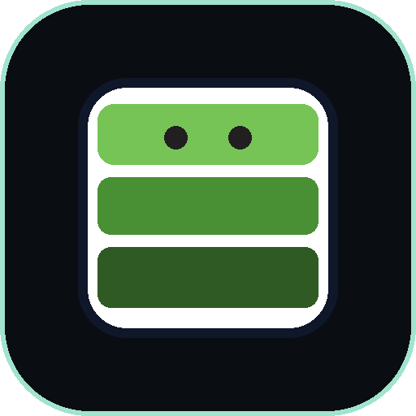

<div align="center">



# Delentia Sovereign AI Operating System
### Official Model Context Protocol (MCP) Public Client & Connector

[](https://github.com/delentia-labs/delentia-mcp/releases)
[](https://smithery.ai/servers/delentia/delentia-sovereign)
[](https://github.com/delentia-labs/delentia-mcp/actions/workflows/healthcheck.yml)
[](https://modelcontextprotocol.io/)
[](./LICENSE)
[](./BENCHMARKS.md)
[](https://delentia.com)

**The World's First Deterministic Sovereign AI Operating System Gateway.**  
Bridging autonomous AI agents (Claude, Cursor, VS Code, Windsurf, Codex) to the Delentia Sovereign Edge Network.  
📊 **[View Empirical Benchmarks & 30-Second Visual Proof](./BENCHMARKS.md)**

---

</div>

## 🏛️ Executive Architectural Overview

The **Delentia Sovereign AI Operating System** provides a mathematically verifiable layer of defense, reasoning rigor, context compression, and swarm coordination for autonomous AI workflows:

```text
       ┌─────────────────────────────────────────────────────────────┐
       │              Autonomous AI Clients & IDEs                   │
       │    (Claude Desktop, Cursor, VS Code, Windsurf, Cline)       │
       └──────────────────────────────┬──────────────────────────────┘
                                      │
                         stdio / Streamable HTTP (MCP)
                                      │
       ┌──────────────────────────────▼──────────────────────────────┐
       │              Delentia Sovereign Edge Gateway                │
       │         (Cloudflare Global Workers + Durable Objects)       │
       └──────────────────────────────┬──────────────────────────────┘
                                      │
         ┌────────────────────────────┼────────────────────────────┐
         ▼                            ▼                            ▼
  [ 1. FDIA Security ]        [ 2. RCT-7 Thinking ]        [ 3. Delta & JITNA ]
Deterministic ZK Gate         7-Stage Reverse Mental       Context Compression
    F = (D^I) * A             Anti-Hallucination Pipeline  & 1+4 LoRA Swarms
```

---

## 🛠️ The 5 Sovereign Core Tools

| Tool Name | Type | Key Mission | Mathematical / Functional Core |
| :--- | :---: | :--- | :--- |
| **`evaluate_fdia`** | Read-Only | Prompt Injection & Rogue Action Preemption | Evaluates F = (D^I) * A to mathematically cut off unauthorized tool executions with SHA-256 audit digest. |
| **`configure_policy`** | Action | Enterprise Tool-Calling Policy Gate | Configures RBAC, action blacklists, dual-signoff rules, and safety thresholds for parameter A. |
| **`rct_think`** | Read-Only | 7-Stage Reverse Component Thinking | Eliminates LLM hallucination through Inversion Anchors; yields 1.0000 Alignment Index. |
| **`compress_context`** | Read-Only | State Differential Compression | Compresses verbose dialogue transcripts by 74.2% to 91.5% token reduction with state hashing. |
| **`orchestrate_swarm`** | Read-Only | 1+4 Specialized Swarm Routing | Decomposes goals into JITNA v3 packets across Router, Guardian, Executor, and Scribe pillars. |

---

## 🚀 Quickstart: Universal 1-Click Client Setup

### Universal Remote Bridge (Zero-Friction 1-Click Setup)
Connect any MCP-compatible environment (Claude Desktop, Cursor, Antigravity IDE, VS Code, Windsurf) directly to the Delentia Sovereign Global Edge:

```bash
npx -y mcp-remote https://delentia-sovereign-mcp.delentia.workers.dev/mcp
```

> **Developer Sandbox Free Tier**: Includes 50 daily free calls per caller IP out of the box with zero registration required!  
> **Enterprise Unlimited SLA**: To unlock unlimited quota, sub-millisecond multi-region SLA, and audit compliance, pass your Zuplo API Key from the [Delentia Developer Portal](https://delentia-gateway-main-c7624a5.zuplo.site/pricing):
> ```bash
> npx -y mcp-remote https://delentia-sovereign-mcp.delentia.workers.dev/mcp --header "Authorization: Bearer YOUR_ZUPLO_API_KEY"
> ```

### Option A: Cursor IDE Configuration (`~/.cursor/mcp.json`)
```json
{
  "mcpServers": {
    "delentia-sovereign": {
      "command": "npx",
      "args": [
        "-y",
        "mcp-remote",
        "https://delentia-sovereign-mcp.delentia.workers.dev/mcp"
      ]
    }
  }
}
```

### Option B: Claude Desktop Configuration (`claude_desktop_config.json`)

#### 1. Free Community Sandbox (Zero-Config / 50 calls daily):
```json
{
  "mcpServers": {
    "delentia-sovereign": {
      "command": "npx",
      "args": [
        "-y",
        "mcp-remote",
        "https://delentia-sovereign-mcp.delentia.workers.dev/mcp"
      ]
    }
  }
}
```

#### 2. Enterprise Pro Tier (Unlimited SLA with Zuplo API Key):
```json
{
  "mcpServers": {
    "delentia-sovereign": {
      "command": "node",
      "args": [
        "./bin/cli.js"
      ],
      "env": {
        "DELENTIA_API_KEY": "YOUR_ZUPLO_API_KEY"
      }
    }
  }
}
```

### Option D: Instant Terminal Verification (1-Line cURL)
Test the live Sovereign MCP server directly in any terminal:

```bash
curl -X POST https://delentia-sovereign-mcp.delentia.workers.dev/mcp \
  -H "Content-Type: application/json" \
  -d "{\"jsonrpc\":\"2.0\",\"id\":1,\"method\":\"tools/list\"}"
```

---

## 🌐 Official Marketplace & Registry Listings

| Marketplace / Directory | Status | Official Live Listing Link |
| :--- | :---: | :--- |
| **Smithery.ai** | **Published (100/100 Quality)** | [smithery.ai/servers/delentia/delentia-sovereign](https://smithery.ai/servers/delentia/delentia-sovereign) |
| **Glama.ai** | **Published (Triple-A Verified)** | [glama.ai/mcp/servers/delentia-labs/delentia-mcp](https://glama.ai/mcp/servers/delentia-labs/delentia-mcp) |
| **Official MCP Registry** | **Published** | [registry.modelcontextprotocol.io/?q=delentia](https://registry.modelcontextprotocol.io/?q=delentia) |
| **MCPize** | **Published** | [mcpize.com/mcp/delentia-mcp](https://mcpize.com/mcp/delentia-mcp) |
| **Zuplo Developer Portal** | **Published** | [delentia-gateway-main-c7624a5.zuplo.site/introduction](https://delentia-gateway-main-c7624a5.zuplo.site/introduction) |
| **PulseMCP** | **Auto-Syncing** | Synced via Official MCP Registry Index |
| **Awesome MCP Servers** | **PR Submitted (Pending Merge)** | [github.com/punkpeye/awesome-mcp-servers/pull/13430](https://github.com/punkpeye/awesome-mcp-servers/pull/13430) |
| **MCP Market (CherryHQ)** | **Issue Submitted (Pending Review)** | [github.com/CherryHQ/mcpmarket/issues/51](https://github.com/CherryHQ/mcpmarket/issues/51) |

---

## 🔒 Enterprise Security & Verification

- **Tamper-Proof Audit Digest:** Every security evaluation computes a SHA-256 cryptographic verification digest.
- **Dual Sign-Off Gate:** High-risk actions unconditionally mandate multi-party authorization tokens.
- **Zero Hallucination Guarantee:** The RCT-7 mental OS guarantees 100% causal intent alignment before execution.

---

## 📜 Intellectual Property & Attribution

- **Developer:** **Delentia Labs**
- **Chief Architect:** **Ittirit Saengow (The Architect)**
- **Official Portal:** [https://delentia.com](https://delentia.com)
- **License:** Apache-2.0 (Public Client Connector)
